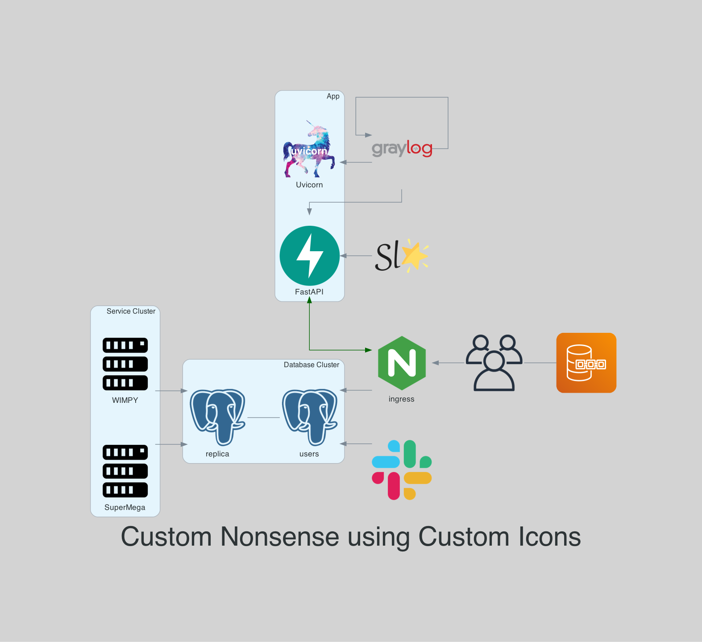

Using Diagrams
---------------
https://github.com/mingrammer/diagrams

## References

* [Docs](https://diagrams.mingrammer.com/docs/getting-started/installation)
* [Graphviz Attributes](https://www.graphviz.org/doc/info/attrs.html)
* [C4 Model](https://c4model.com/)

## Example Diagram Output

